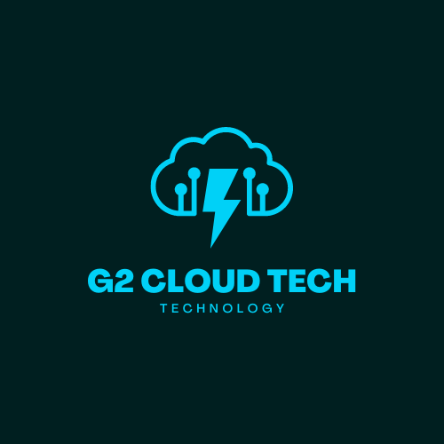
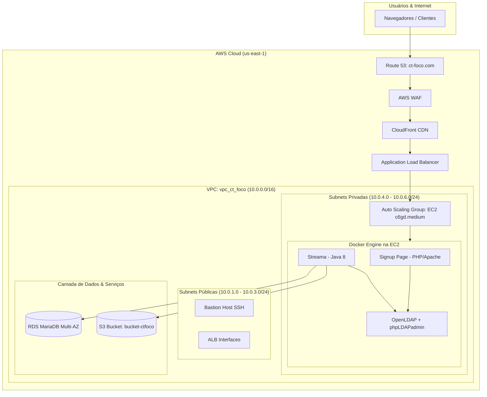
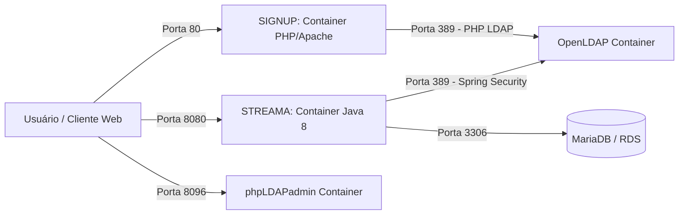

# 🎬 Projeto Streama — Streaming com AWS Cloud, Docker, OpenLDAP & DevSecOps SAST

<p align="center">
  
</p>

<p align="center">
  <b>Projeto de Oficina Prática — Cloud Treinamentos / Pós-Graduação em Arquitetura Cloud & DevOps</b><br>
  <i>Desenvolvido originalmente pelo Grupo 2 — G2 Cloud Tech (Agosto / 2023)</i><br>
  <i>Evoluído posteriormente em estudos de <b>DevSecOps & Segurança de Aplicações</b></i>
</p>

<p align="center">
  <a href="https://github.com/HerissonS/projeto-streama/actions/workflows/sast.yml">
    
  </a>
  
  
  
  
  
  
</p>

---

## 📌 Sumário
- [Sobre o Projeto](#-sobre-o-projeto)
- [Contexto Acadêmico & Desafio de Negócio](#-contexto-acadêmico--desafio-de-negócio)
- [Evolução DevSecOps](#-evolução-devsecops)
- [Arquitetura da Solução](#-arquitetura-da-solução)
  - [1. Arquitetura Proposta para Produção na AWS](#1-arquitetura-proposta-para-produção-na-aws-teórica)
  - [2. Arquitetura do Laboratório de Prova de Conceito (Docker)](#2-arquitetura-do-laboratório-de-prova-de-conceito-docker)
  - [3. Esteira CI/CD & DevSecOps (SAST Pipeline & Security Gate)](#3-esteira-cicd--devsecops-sast-pipeline--security-gate)
- [Componentes da Solução](#-componentes-da-solução)
- [Fluxo de Autenticação Centralizada](#-fluxo-de-autenticação-centralizada)
- [SAST — Static Application Security Testing (Semgrep)](#-sast--static-application-security-testing-semgrep)
- [Mapeamento de Portas e Rede](#-mapeamento-de-portas-e-rede)
- [Banco de Dados (MariaDB)](#-banco-de-dados-mariadb)
- [Segurança & Boas Práticas (Hardening)](#-segurança--boas-práticas-hardening)
- [Como Executar o Laboratório](#-como-executar-o-laboratório)
- [Documentação Original & Artefatos](#-documentação-original--artefatos)
- [Aprendizados & Engenharia de Nuvem](#-aprendizados--engenharia-de-nuvem)
- [Melhorias Futuras Técnicas](#-melhorias-futuras-técnicas)
- [Integrantes do Grupo (G2 Cloud Tech)](#-integrantes-do-grupo-g2-cloud-tech)
- [Atribuição de Autoria e Licença](#-atribuição-de-autoria-e-licença)

---

## 📌 Sobre o Projeto

Este repositório apresenta a infraestrutura e arquitetura de um serviço de streaming de vídeo em nuvem, integrando serviços gerenciados da **AWS**, conteinerização com **Docker**, diretório centralizado de usuários via **OpenLDAP**, um portal web de cadastro em **PHP** e pipeline de segurança cibernética **SAST com Semgrep via GitHub Actions**.

> [!NOTE]
> O núcleo da plataforma de streaming utiliza o software *open-source* [Streama](https://github.com/streamaserver/streama), desenvolvido pela comunidade. Este projeto foca na **arquitetura de infraestrutura, conteinerização, segurança de código (SAST), integração LDAP e implantação em nuvem**.

---

## 🎯 Contexto Acadêmico & Desafio de Negócio

* **Empresa Fictícia (Cliente)**: **CT Foco** — Startup brasileira de vídeos educativos e documentários.
* **Problema**: A CT Foco possuía 30 documentários (1 hora cada) e desejava lançar uma plataforma de assinaturas online. A empresa não possuía equipe de infraestrutura e uma solução *on-premises* era financeiramente inviável.
* **Desafio Entregue pelo Grupo (G2 Cloud Tech)**:
  1. Desenhar a arquitetura de produção em nuvem na AWS com alta disponibilidade, escalabilidade automática e segurança.
  2. Apresentar uma proposta comercial com estimativa realista de custos mensais (calculadora AWS).
  3. Construir um laboratório/protótipo funcional conteinerizado combinando a aplicação Streama, autenticação via OpenLDAP e página de autosserviço de cadastro de usuários.

---

## 🔄 Evolução DevSecOps

O projeto passou por um ciclo claro de evolução técnica:

```text
Projeto Acadêmico Original (2023)
        │
        ├── AWS Architecture (ALB, Auto Scaling, RDS, CloudFront, WAF)
        ├── Docker Containers (Streama, OpenLDAP, phpLDAPadmin, Signup PHP)
        └── Automação de Shell Script (streama.sh)
        │
        ▼  Evolução Posterior (Estudos de DevSecOps)
        │
        ├── Sanitização de Credenciais & Secret Management (.env.example, .gitignore)
        ├── Automação Não-Destrutiva de Scripts
        └── Pipeline SAST em 2 Fases (Semgrep Native Container + SARIF + Security Gate --error)
```

1. **Fase 1 — Projeto Acadêmico Original (Agosto/2023)**: Desenvolvimento da proposta de arquitetura cloud na AWS, prova de conceito com Docker Compose, integração PHP + LDAP e documentação técnica.
2. **Fase 2 — Evolução DevSecOps & Hardening (Posterior)**: Sanitização de credenciais expostas, parametrização via variáveis de ambiente, criação de `.gitignore` e implementação de esteira SAST em **duas fases (Visibilidade SARIF + Security Gate com `--error`)** automatizada via **GitHub Actions** utilizando o container oficial do **Semgrep**.

---

## 📐 Arquitetura da Solução

O projeto compreende a arquitetura de produção planejada para a AWS, o laboratório conteinerizado em Docker e a esteira automatizada de DevSecOps.

### 1. Arquitetura Proposta para Produção na AWS (Teórica)

Projetada para suportar alta carga com tolerância a falhas em 3 Zonas de Disponibilidade (Multi-AZ):



* **VPC**: Redes privadas e públicas segregadas (`10.0.0.0/16`).
* **Compute**: Auto Scaling Group (`asg-ct-foco`) com instâncias EC2 (`c6gd.medium` Ubuntu 22.04) em subnets privadas.
* **Edge & Security**: Amazon Route 53, AWS WAF (regras contra SQLi/PHP/Bots), CloudFront CDN, ACM (Certificado SSL/TLS) e Application Load Balancer.
* **Storage & DB**: Amazon S3 com Intelligent-Tiering para mídia e Amazon RDS MariaDB 10.6.11 Multi-AZ (`db.t4g.medium`).
* **Estimativa Financeira Proposta**: **US$ 463,42 / mês** (conforme relatório técnico original do projeto).

---

### 2. Arquitetura do Laboratório de Prova de Conceito (Docker)

No ambiente de demonstração prática, os componentes rodaram conteinerizados em uma instância Linux:



---

### 3. Esteira CI/CD & DevSecOps (SAST Pipeline & Security Gate)

Pipeline automatizada em duas fases executada diretamente no container oficial do Semgrep no GitHub Actions:

```mermaid
flowchart TD
    Developer[Código Autoral PHP/Shell] -->|git push| GitHub[GitHub Repository]
    GitHub -->|Trigger Workflow| GHA[GitHub Actions Runner]
    
    subgraph Container [Container: semgrep/semgrep]
        Checkout[actions/checkout@v4] --> Step1[Fase 1: SARIF Scan]
        Step1 -->|semgrep.sarif| Step2[Upload SARIF -> Code Scanning Alerts]
        Step2 --> Step3[Fase 2: Security Gate]
        Step3 -->|semgrep scan --error| Decision{Achados Bloqueantes?}
        Decision -->|Sim| Fail[Pipeline FAILED - Exit Code 1]
        Decision -->|Não| Pass[Pipeline PASSED - Exit Code 0]
    end
```

---

## 🛠️ Componentes da Solução

| Componente | Tecnologia / Imagem | Descrição & Responsabilidade |
| :--- | :--- | :--- |
| **Streama** | `anapsix/alpine-java:8` | Aplicação web de streaming em Java (Grails/Spring Security). Gerencia catálogo e reprodução. |
| **OpenLDAP** | `osixia/openldap:latest` | Serviço de diretório LDAP para gerenciamento centralizado de identidades de usuários. |
| **phpLDAPadmin** | `osixia/phpldapadmin:latest` | Interface web administrativa para visualização, gestão e importação de arquivos `.ldif`. |
| **Signup Portal** | `php:apache` (Custom Dockerfile) | Portal em PHP/HTML/CSS desenvolvido pelo grupo para autosserviço de cadastro de novos usuários. |
| **MariaDB** | RDS / MariaDB 10.6 | Banco de dados relacional para persistência dos metadados e configurações do Streama. |
| **Semgrep SAST** | `semgrep/semgrep` Container | Motor de Análise Estática de Segurança automatizado via GitHub Actions. |

---

## 🔐 Fluxo de Autenticação Centralizada

1. **Cadastro do Assinante**:
   * O usuário acessa a página de Signup na porta `80` (`http://<IP_SERVIDOR>/`).
   * O formulário envia as informações para `addUser.php`.
   * O script PHP realiza um *bind* administrativo e adiciona a nova entrada `inetOrgPerson` no diretório em `cn=<email>,ou=People,dc=g2cloud,dc=com`.

2. **Acesso à Plataforma Streama**:
   * O usuário clica no link de login e é direcionado para a porta `8080` (`http://<IP_SERVIDOR>:8080`).
   * Ao informar suas credenciais, o **Spring Security LDAP Provider** do Streama faz uma busca no OpenLDAP na porta `389` filtrando por `cn={0}`.
   * Validadas as credenciais no LDAP, a sessão no Streama é iniciada com perfil de visualizador.

---

## 🔍 SAST — Static Application Security Testing (Semgrep)

O **SAST (Static Application Security Testing)** analisa o código-fonte da aplicação sem executá-la, identificando padrões inseguros, vulnerabilidades de injeção, falhas em chamadas de API e manipulação inadequada de dados.

Diferente de testes dinâmicos (DAST) ou análises de dependência (SCA), o SAST opera diretamente sobre o código autoral.

### O Workflow no GitHub Actions (`.github/workflows/sast.yml`)

Substituindo a action depreciada `semgrep-action@v1`, a nova implementação executa o **container oficial `semgrep/semgrep`** nativamente no runner do GitHub Actions em **duas fases distintas**:

#### 1. Fase de Visibilidade (SARIF Upload)
* Executa `semgrep scan` com as opções `--sarif --output=semgrep.sarif`.
* Utiliza `continue-on-error: true` exclusivamente neste passo para garantir a criação do relatório mesmo que existam vulnerabilidades.
* O relatório `semgrep.sarif` é enviado via `github/codeql-action/upload-sarif@v3` com `if: always()`, alimentando a aba **Security > Code Scanning Alerts** do repositório no GitHub.

#### 2. Fase de Controle (Security Gate / Bloqueio)
* Executa `semgrep scan` com a flag de controle `--error`.
* **NÃO utiliza `continue-on-error`**.
* **Comportamento de Exit Code**: Caso o Semgrep encontre vulnerabilidades que correspondam aos *rulesets* configurados, a CLI do Semgrep encerra com código de saída **`1` (Exit Code 1)**, fazendo o step e a pipeline do GitHub Actions **falharem (STATUS: FAILED)**. Se nenhum achado bloqueante for detectado, o encerramento ocorre com **`0` (STATUS: PASSED)**.

### Regras Habilitadas (`--config`)
* `p/php`: Regras específicas para detecção de vulnerabilidades em PHP (LDAP Injection, Command Injection, XSS, sanitização).
* `p/security-audit`: Regras gerais de auditoria de segurança de código.
* `p/owasp-top-10`: Verificação contra os 10 principais riscos de segurança da OWASP.

### Escopo & Privilégios
* **Escopo**: Focado no código autoral desenvolvido no projeto (`SIGNUP/*.php`, scripts shell e arquivos de configuração). O binário do Streama (software open-source de terceiros em Java) é ignorado.
* **Princípio do Menor Privilégio (`permissions`)**:
  ```yaml
  permissions:
    contents: read
    security-events: write
  ```
* **Execução 100% OSS**: Não requer tokens de nuvem (`SEMGREP_APP_TOKEN`) nem contas externas para a execução.

> [!IMPORTANT]
> **Execução no GitHub Actions**: O scan SAST do Semgrep é executado exclusivamente no runner do GitHub Actions após o envio dos commits via `git push`. Nenhuma ferramenta de segurança é instalada ou executada na máquina local de desenvolvimento.

---

## 🌐 Mapeamento de Portas e Rede

| Porta | Protocolo | Serviço | Exposição Recomendada | Finalidade |
| :--- | :--- | :--- | :--- | :--- |
| **80** | HTTP | Signup Page | Pública | Acesso público ao formulário de cadastro de usuários. |
| **8080** | HTTP | Streama Video | Pública | Interface web principal de streaming de vídeo. |
| **8096** | HTTP | phpLDAPadmin | Restrita (VPN / SSH) | Painel de gestão do LDAP (somente administradores). |
| **389** | LDAP | OpenLDAP | Privada (VPC) | Comunicação interna de autenticação entre PHP/Streama e LDAP. |
| **636** | LDAPS | OpenLDAP (SSL) | Privada (VPC) | Comunicação criptografada via LDAP sobre TLS. |
| **3306** | MySQL | MariaDB | Privada (VPC) | Conexão de dados da aplicação Streama ao banco de dados. |

---

## 🗄️ Banco de Dados (MariaDB)

O Streama utiliza o ORM GORM para auto-gerenciar suas tabelas relacionais. O banco de dados armazena:
* Registros de mídias, episódios e filmes cadastrados.
* Contas de administradores nativos do Streama.
* Configurações de exibição e progresso de vídeos.

As configurações de conexão são mantidas no arquivo `STREAMA/application.yml`.

---

## 🛡️ Segurança & Boas Práticas (Hardening)

Neste repositório foram aplicadas correções de segurança essenciais em código e infraestrutura:

* **Omissão de Senhas Hardcoded**: Todas as credenciais padrão de administração e banco de dados foram removidas dos arquivos de código (`addUser.php`, `docker-compose.yml`, `application.yml`, `usuario.ldif`).
* **Variáveis de Ambiente (`.env`)**: Introduzido o arquivo modelo `.env.example` para parametrizar senhas sem expor dados sensíveis.
* **Proteção de Repositório (`.gitignore`)**: Impedimento de subida de arquivos `.env`, logs e temporários.
* **Automação Não-Destrutiva**: Refatoração do `streama.sh` com cópias seguras (`cp`) e permissões `755`.
* **Análise Automatizada de Segurança (SAST & Security Gate)**: Varredura contínua de vulnerabilidades no código PHP a cada push via Semgrep Container no GitHub Actions com bloqueio via `--error`.

---

## 🚀 Como Executar o Laboratório

### Pré-requisitos
* Servidor Linux (Ubuntu 20.04 / 22.04 recomendado).
* Docker Engine e Docker Compose instalados.
* Instância de banco de dados MariaDB/MySQL operacional.

### Passo a Passo

1. **Clonar o Repositório**:
   ```bash
   git clone https://github.com/HerissonS/projeto-streama.git
   cd projeto-streama
   ```

2. **Configurar Variáveis de Ambiente**:
   ```bash
   cp .env.example .env
   # Edite o arquivo .env e defina suas senhas de administração e parâmetros de banco
   nano .env
   ```

3. **Configurar o Banco de Dados em `STREAMA/application.yml`**:
   Substitua o host e o nome do banco de dados pelas suas informações reais:
   ```yaml
   url: "jdbc:mysql://SEU_ENDPOINT_MARIADB:3306/SEU_NOME_DB"
   ```

4. **Executar o Deploy Automático**:
   ```bash
   chmod +x streama.sh
   ./streama.sh
   ```

5. **Importar a Estrutura Inicial do LDAP**:
   * Acesse o phpLDAPadmin em `http://<IP_DO_SERVIDOR>:8096`.
   * Faça login com o Login DN administrativo (ex: `cn=admin,dc=g2cloud,dc=com`) e a senha definida no seu `.env`.
   * Clique em **Import** e envie o arquivo `LDAP/usuario.ldif`.

6. **Testar os Acessos**:
   * **Cadastro de Usuário**: `http://<IP_DO_SERVIDOR>:80`
   * **Login no Streama**: `http://<IP_DO_SERVIDOR>:8080`

---

## 📂 Documentação Original & Artefatos

A documentação técnica oficial produzida pelo grupo durante a pós-graduação está preservada neste repositório:

* 📄 **Documentação Completa da Proposta AWS (PDF)**: [`docs/project/G2-Documentacao-Projeto-12-v3.pdf`](docs/project/G2-Documentacao-Projeto-12-v3.pdf)
* 🎨 **Identidade Visual & Logos**: [`docs/images/`](docs/images/)
* ⚙️ **Workflow de SAST DevSecOps**: [`.github/workflows/sast.yml`](.github/workflows/sast.yml)

---

## 📈 Aprendizados & Engenharia de Nuvem

* **DevSecOps & Security Gate**: Integração de análise estática de código (SAST) em duas fases (Visibilidade SARIF + Bloqueio via exit code `--error`) em pipelines CI/CD com GitHub Actions.
* **Arquitetura de Alta Disponibilidade**: Projeto de soluções escaláveis na AWS utilizando balanceamento de carga, Auto Scaling e banco de dados gerenciado Multi-AZ.
* **Autenticação Centralizada**: Conexão entre ecossistema Java/Spring Security e serviços de diretório OpenLDAP.
* **Desenvolvimento Web & Integração**: Construção de formulários em PHP com integração nativa via `php-ldap`.
* **Conteinerização**: Isolamento e orquestração de microsserviços via Docker Compose.

---

## 🔮 Melhorias Futuras Técnicas

Estrutura de evolução continuada da esteira DevSecOps e infraestrutura:

* [x] **SAST Pipeline & Security Gate**: Análise estática de código com Semgrep Container, relatório SARIF e bloqueio via `--error`.
* [ ] **SCA / Dependency Scanning**: Análise de vulnerabilidades em dependências de pacotes (Composer Audit / Dependabot).
* [ ] **Container Scanning**: Varredura de vulnerabilidades em imagens Docker (Trivy / Anchore).
* [ ] **Secret Scanning**: Detecção automatizada de segredos em commits (Gitleaks / Trufflehog).
* [ ] **DAST (Dynamic Analysis)**: Análise dinâmica de segurança da aplicação web em ambiente de staging (OWASP ZAP).
* [ ] **Infraestrutura como Código (IaC)**: Provisionar a infraestrutura AWS via Terraform ou OpenTofu.
* [ ] **HTTPS / Ingress Controller**: Configurar Nginx Reverse Proxy com Let's Encrypt para encerramento de TLS nas portas 8080 e 8096.
* [ ] **LDAPS (LDAP sobre TLS)**: Habilitar criptografia SSL/TLS na comunicação LDAP (porta 636).

---

## 👥 Integrantes do Grupo (G2 Cloud Tech)

Trabalho em equipe realizado pelos integrantes do Grupo 2:

| Nome | LinkedIn |
| :--- | :--- |
| **Ailton Euclides Garcia Filho** | [](https://www.linkedin.com/in/ailton-euclides-garcia-filho-991a3a135/) |
| **André Caliari** | [](https://www.linkedin.com/in/acaliari/) |
| **Arlindo Ferreira da Silva Ramos** | [](https://www.linkedin.com/in/arlindo-ramos/) |
| **Everton Minoru Nakatani** | [](https://www.linkedin.com/in/minorunakatani) |
| **Gilberto Soares Domingues** | [](https://www.linkedin.com/in/gilberto-domingues/) |
| **Giselly Rebouças** | [](https://www.linkedin.com/in/giselly-reboucas-b29b42b2/) |
| **Herisson Silva** | [](https://br.linkedin.com/in/herisson-silva-7275a0187) |
| **Lucas dos Santos Moraes** | [](https://www.linkedin.com/in/lucaspanik/) |
| **Marcio Peduzzi** | [](https://www.linkedin.com/in/marcio-peduzzi) |
| **Mark Pessoa** | [](https://www.linkedin.com/in/markpessoa) |
| **Nicolas Matos** | [](https://www.linkedin.com/in/nicolasmatos-dev/) |
| **Peterson Luiz de Souza Silva** | [](https://www.linkedin.com/in/peterson-ti) |
| **Robson Ferraz do Amaral** | [](https://www.linkedin.com/in/robson-cloud-aws/) |

---

## 📜 Atribuição de Autoria e Licença

* **Projeto Streama Original**: [streamaserver/streama](https://github.com/streamaserver/streama) (Desenvolvido pela comunidade open-source).
* **Este Repositório**: Contém os arquivos de infraestrutura, arquitetura AWS, orquestração Docker, scripts de automação e código do portal de cadastro desenvolvidos originalmente na Oficina de Projetos da Cloud Treinamentos e evoluídos com práticas de DevSecOps (Semgrep SAST Native Container, Security Gate com `--error`, SARIF e GitHub Actions).